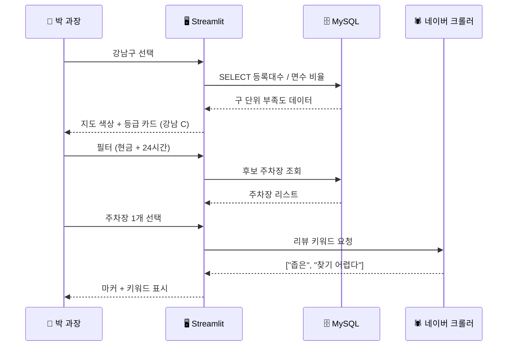

# 🅿️ Search-Park - 주차장 검색 및 지역별 수급 분석 대시보드

<p align="center">
  <b>"빈자리"를 넘어 "이 지역이 원래 얼마나 혼잡한지"까지 데이터로 보여주는 대시보드.</b><br>
  공공데이터 + 네이버 리뷰 + 자동차 등록 통계
</p>

<p align="center">
  
  
  
  
  
  
</p>

## 1. ⌨️ 프로젝트 개요

- **프로젝트명** : Search-Park (SK Networks Family 28기 · 1차 프로젝트 2조)
- **기간** : 2026.04 ~ 2026.05
- **구성원** : 5명 (팀장 · 데이터 수집/전처리 · UI/UX · 데이터 처리 · 협업/크롤링)
- **내 역할** : **네이버 리뷰 크롤러 · 협업 환경(Notion) 구축**
- **원본 저장소** : `SKNETWORKS-FAMILY-AICAMP/SKN28-1st-2team` (이 저장소는 fork)

---

## 2. 🎯 왜 만들었나

기존 지도 서비스의 "주변 주차장" 검색은 **지금 빈자리**만 알려준다. 그래서 "여기 항상 비는 곳이야, 거긴 원래 혼잡해" 같은 **지역 단위 의사결정 정보**를 줄 수 없었다.

| | 기존 지도 검색 | 이 서비스 |
|---|---|---|
| 표시 단위 | 개별 주차장 | **행정구역(구·동)** |
| 데이터 성격 | 실시간 점유 | **자동차 등록 대수 vs 주차 면수 + 리뷰 정성 신호** |
| 시간축 | 지금 | **당일 운영 마감 + 누적 혼잡도 등급** |
| 정량/정성 | 정량(면수)만 | **정량 + 네이버/구글 리뷰 키워드** |
| 의사결정 도움 | "여기 가면 자리 있다/없다" | "이 지역은 원래 부족하다" |

**해결하려는 문제 세 가지**
- **정보 비대칭** - "주차장 많다/적다"는 아는데, "내 차가 등록된 지역이 주차난이 심한가"는 모름
- **실시간만으로는 부족** - 빈자리는 변하지만, 구조적 부족은 안 변함. 둘을 같이 봐야 함
- **결정권자 관점 부재** - 운전자가 아닌, **행정/시설 담당자**가 보기에도 유용한 지표가 필요

---

## 3. 👤 사용자 시나리오

### 시나리오 A - 평일 저녁, 회사 근처 주차

> 박 과장(40대)은 평일 저녁 7시에 강남구 회사 근처 식당에 차를 댈 곳을 찾는다.

1. `/` 페이지에서 "강남구" 선택 → **자동차 등록 대수 vs 주차 면수 비율**이 낮은(부족한) 지역이 빨갛게 표시.
2. 같은 화면의 **혼잡도 등급 카드** - "강남구 일대: 등급 C (혼잡)" 표시.
3. 필터에서 "현금 결제 가능" + "24시간 운영" → 후보 주차장 리스트.
4. 리스트 중 하나 선택 → Folium 지도의 마커 + 네이버 리뷰 핵심 키워드("좁은", "찾기 어렵다") 노출.
5. 박 과장은 혼잡도가 낮은 인접 구(예: 서초구)로 이동 결정.



### 시나리오 B - 자치구 담당자, 신규 주차장 입지 검토

> 김 주무관(자치구 교통행정)은 신설 주차장 후보지를 검토 중. "이 구에 정말 더 필요한가"를 데이터로 답하고 싶다.

1. 자치구 대시보드 진입 → **자동차 등록 대수 대비 주차 면수 비율** 차트 확인.
2. **혼잡도 등급 지도**에서 자치구 위치 확인 → 등급 D (심각) 구간.
3. **네이버/구글 리뷰 키워드** 워드클라우드 - "만원", "주차시간 부족", "회전 어려움" 등 정성 신호.
4. 신규 후보지 좌표를 지도에 얹어 **서비스 권역 반경 500m 내 기존 주차장 vs 등록 대수** 비교.
5. 보고서 출력: 혼잡도 + 키워드 + 입지 추천 근거 자동 채움.

> **기대 효과** - 주민 민원 의존도 줄이고, 정량/정성 데이터로 **입지 선정의 근거 문서**를 빠르게 만든다.

---

## 4. ⭐️ 핵심 기능

| 기능 | 입력 | 출력 | 비고 |
|---|---|---|---|
| **주차장 맞춤 검색** | 이름/지역/결제수단/운영시간 | 후보 주차장 리스트 + 지도 | 당일 마감까지 남은 시간 자동 계산 |
| **행정구역 통계** | 자치구/행정동 선택 | 등록 대수 vs 면수 비율 차트 | 부족도 색상 단계 |
| **혼잡도 지수** | 지역 + 리뷰 데이터 | 등급 (A~D) | 네이버/구글 리뷰 키워드 가중치 |
| **리뷰 키워드 시각화** | 주차장 ID | 핵심 키워드 워드클라우드 | 혼잡도 정성 근거 |
| **운영 마감 카운트다운** | 주차장 ID + 현재 시각 | "n시간 m분 남음" | 실시간 운영 여부 자동 필터링 |

---

## 5. 🙋 내가 한 일 - 전하영 ([@vosnuev](https://github.com/vosnuev))

> 5명 중 데이터 협업/리뷰 크롤링 담당. 검색 품질을 좌우하는 리뷰 데이터 파이프라인을 만들었다.
> 각 항목은 저장소 안의 `src/collect/` 코드와 커밋 이력으로 근거를 확인할 수 있다.

| 영역 | 내가 맡은 범위 | 스택 |
|---|---|---|
| **네이버 리뷰 크롤러** | 네이버 지도/장소 데이터에서 주차장 리뷰 수집 · 키워드 추출 | Python · Selenium · BeautifulSoup · Requests |
| **DB 스키마 보조** | 네이버 리뷰/장소 매핑 테이블 설계 보조 | MySQL 8.0 · SQLAlchemy |
| **협업 환경 구축** | 팀 Notion 워크스페이스 구성 · 문서/회의록 템플릿 | Notion |
| **데이터 파이프라인 연결** | 크롤러 출력을 전처리기(`preprocessor.py`)에 연결 | Pandas |

<br/>

### 1️⃣ 네이버 리뷰 크롤러 - 혼잡도 등급의 원천 데이터

기존 지도 서비스는 "지금 빈자리" 만 보여준다. 이 프로젝트가 보여주고 싶은 건 "이 지역이 원래 얼마나 혼잡한가" 인데, 그 정성 데이터의 1차 출처가 **네이버 지도 리뷰** 다. 별점·키워드("좁다", "찾기 어렵다" 등)를 추출해 후속 혼잡도 등급화 함수에 넘긴다.

**구현 흐름** - `src/collect/naver_logic.py` (메인 진입점) → `naver_models.py` (ORM 모델) → `02.naver_map_db.sql` (스키마)

```text
[네이버 검색 API / Selenium]
        │  장소별 리뷰 페이지
        ▼
[naver_logic.py]
   - 리뷰 텍스트 / 별점 / 작성일 / 키워드 추출
        │
        ▼
[naver_models.py] (place, review, keyword 테이블 매핑)
        │
        ▼
[MySQL 8.0]  →  전처리기(preprocessor.py)  →  혼잡도 지수 산출
```

**왜 Selenium까지** - 네이버 검색 API는 장소 검색만 안정적이고, **리뷰 본문**은 공식 API에 노출되지 않는다. 그래서 Selenium으로 검색 결과 페이지를 띄우고 `BeautifulSoup`으로 본문을 파싱했다. `Requests`만으론 차단이 자주 걸려서 Selenium을 폴백으로 두는 구조.

**왜 1차 버전 파일은 삭제됐나** - 초기엔 `01.naver_logic(main).py` / `02.naver_map_db.sql` / `03.naver_models.py` 식의 번호 prefix로 분리했는데, **모듈 import 순서 / 의존성 / 모델 일관성**을 정리하면서 `naver_logic.py` + `naver_models.py` + `02.naver_map_db.sql` 형태로 재구성. 흔적이 남은 이유는 git history에 의도적으로 보존.

---

### 2️⃣ 협업 환경(Notion) - 5명이 같은 문서 위에서 일하게

5명이 다른 파트(팀장 / DB / 데이터 수집 / UI / 처리 / 크롤링)로 나뉘어 작업할 때, **회의록 / 의사결정 / 데이터 사전 / ERD 변경 이력 / 데모 시나리오**가 한 곳에 모이지 않으면 같은 문서를 다섯 버전으로 살게 된다. 그래서 **Notion 워크스페이스를 단일 출처**로 잡고 템플릿을 미리 깔아뒀다.

- 회의록 (날짜별 자동 페이지)
- 데이터 사전 (원천 · 컬럼 · 전처리 규칙)
- ERD 변경 이력 (Pull Request 링크 + 변경 사유)
- 데모 시나리오 (Streamlit 화면 캡처 + 클릭 동선)
- 데일리 스탠드업 보드

> 직접 코드를 만지는 사람은 적고, 문서로 합의를 보는 사람이 더 많다는 가정. 그래서 **코드는 깃허브, 합의는 노션**으로 분리.

---

### 3️⃣ 그 외 기여

- **DB 스키마 보조** - `02.naver_map_db.sql`로 `place` / `review` / `keyword` 3테이블 매핑 정의, ERD(`최종ERD.png`)에 반영.
- **데이터 파이프라인 연결** - 크롤러 출력(원시 리뷰)을 `preprocessor.py`가 받는 형태로 정규화해 Pandas DataFrame → MySQL 적재 단계까지 무결하게 흘러가게 정리.
- **크롤링 안정화** - Selenium 폴백 + `webdriver_manager`로 드라이버 버전 이슈 제거, 차단 회피용 요청 간격 (sleep) 일관화.

<br/>

---

## 6. ⚙️ 시스템 아키텍처


| 계층 | 서비스 | 역할 | 통신 |
|---|---|---|---|
| **클라이언트** | `Streamlit` (Web) | 대시보드 UI · 검색 · 지도 · 차트 | Web |
| **애플리케이션** | `src/main.py` | Streamlit entry · 페이지 라우팅 | Python |
| **전처리** | `src/preprocessor.py` | 원천 데이터 정규화 · 결측 처리 · 병합 | Pandas |
| **수집** | `src/collect/naver_logic.py` | 네이버 리뷰 크롤링 (Selenium + BS4) | HTTP |
| | `src/collect/naver_models.py` | place · review · keyword ORM 매핑 | SQLAlchemy |
| | `src/collect/02.naver_map_db.sql` | 네이버 매핑 스키마 DDL | SQL |
| **데이터 처리** | `src/process/` | 혼잡도 지수 산출 · 등급화 · 키워드 추출 | Pandas |
| **데이터** | MySQL 8.0 | 등록 대수 · 면수 · 리뷰 · 키워드 | SQL |
| **기타** | `src/utils/` | 공통 유틸 (env, logging) | - |

**흐름** - `Streamlit UI → main.py → (DB 조회) + (크롤러 호출) → preprocessor.py 정규화 → process/ 혼잡도 지수 → 결과 반환`

---

## 7. 🛠️ 기술 스택

| 영역 | 사용 기술 |
|---|---|
| Language | Python 3.12 |
| Web Framework | Streamlit |
| Database | MySQL 8.0 · SQLAlchemy · mysql-connector-python |
| Data Analysis | Pandas · Matplotlib |
| Visualization | Folium (지도) · Streamlit Charts |
| Crawling | BeautifulSoup · Selenium · webdriver_manager · Requests |
| Config | python-dotenv |
| Collaboration | GitHub · Notion |

---

## 8. 👥 팀원

| 이름 | GitHub | 주요 영역 |
|---|---|---|
| 박건우 | [@92shepherd](https://github.com/92shepherd) | 팀장 · DB 설계 · ERD 구축 · 구글 리뷰 크롤링 |
| 김성재 | - | 데이터 수집 및 전처리 · 자동차 등록 데이터 가공 |
| 송윤경 | - | 데이터 가공 · UI/UX 설계 · 중랑구 주차 데이터 분석 |
| 이명빈 | - | 전국 주차장 데이터 처리 및 정제 |
| **전하영** | [**@vosnuev**](https://github.com/vosnuev) | **네이버 리뷰 크롤러 · DB 스키마 보조 · 협업 환경(Notion) 구축** |

---

## 9. 📁 저장소 구조

```
Search-Park/
├── src/
│   ├── main.py              # Streamlit entry
│   ├── preprocessor.py      # 데이터 정규화
│   ├── collect/             # 🕷 네이버 리뷰 크롤링 (전하영)
│   │   ├── naver_logic.py
│   │   ├── naver_models.py
│   │   └── 02.naver_map_db.sql
│   ├── process/             # 혼잡도 지수 · 등급화
│   ├── data/                # 정제 데이터
│   ├── db/                  # DB 초기화 · 백업 SQL
│   │   ├── car_park/
│   │   └── raw/
│   ├── ui/                  # 페이지별 UI 컴포넌트
│   ├── utils/               # 공통 유틸
│   └── _pages_backup/       # 페이지 백업
├── 최종ERD.png              # 최종 ERD 다이어그램
├── 최종 ERD-snapshot.json   # ERD JSON export
├── yoonkyong/  yoonkyongs/  # 협업 폴더 (이름 변경 가능)
├── requirements.txt         # pip 의존성
├── Notice.md                # 팀 공지
├── .env.example             # 환경 변수 템플릿
├── test.sql  test2.py       # DB / 로직 검증
└── README.md                # 이 문서
```

---

## 10. 🚀 빠른 시작

> 환경변수는 `.env`로 관리한다. `.env.example`을 복사해 실제 값을 채워 사용.

### 설치

```bash
git clone https://github.com/vosnuev/Search-Park.git
cd Search-Park
pip install -r requirements.txt
```

### 전처리

```bash
python src/preprocessor.py
# (선택) 크롤링 데이터 적재: src/db/result_crawling.sql 실행
```

### 실행

```bash
streamlit run src/main.py
```

기본 URL: http://localhost:8501

### 크롤러 단독 실행

```bash
python -m src.collect.naver_logic
```

---

## 11. 🔐 환경 변수

| 변수 | 용도 |
|---|---|
| `DB_HOST` · `DB_PORT` · `DB_USER` · `DB_PASSWORD` · `DB_NAME` | MySQL 8.0 접속 |
| `NAVER_MAP_CLIENT_ID` · `NAVER_MAP_CLIENT_SECRET` | 네이버 지도 API |
| `CRAWL_SLEEP_SEC` | 크롤링 요청 간격 (차단 회피) |
| `CHROME_DRIVER_PATH` | (선택) Selenium WebDriver 명시 경로 |

> `.env`는 커밋 금지. `.env.example`만 깃에 포함.

---

## 12. 📚 문서

| 문서 | 내용 |
|---|---|
| `최종ERD.png` / `최종 ERD-snapshot.json` | 최종 ERD 다이어그램 (DB 설계) |
| `Notice.md` | 팀 공지 (설치/실행 요약) |
| `requirements.txt` | pip 의존성 |
| `src/db/` | DB 초기화 SQL · 스키마 백업 |
| `src/collect/` | 네이버 리뷰 크롤러 코드 |

---

<p align="center">
  <sub>SK Networks Family 28기 · 1차 프로젝트 2조 · Search-Park</sub>
</p>
