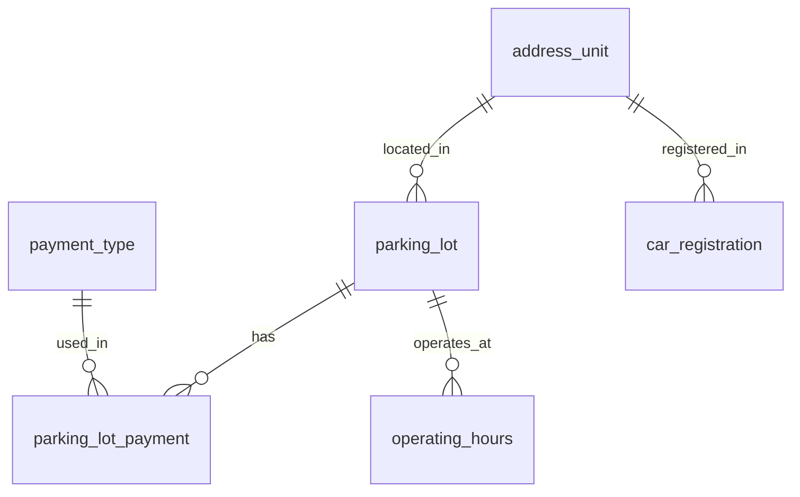

# 🅿️ Car Park Search Park — 주차장 찾기 + 주차장 통계 지표 대시보드
> **SK Networks Family 28기 1차 프로젝트 (2조)** <br>
> 공공데이터 API를 활용한 대용량 주차장 데이터 분석 및 시각화 웹 서비스

## 1. 👥 팀 소개 및 역할
| 이름 | 역할 및 담당 업무 | GitHub |
|:---:|---|---|
| **박건우** | **Team Leader** / DB 구축 / ERD 설계 / 웹 크롤링 (구글 리뷰) | [@92shepherd](https://github.com/92shepherd) |
| **김성재** | 데이터 수집 및 가공 / 자동차 등록 데이터 처리 | - |
| **송윤경** | 데이터 수집 및 가공 / UI·UX 구성 / 중랑구 공영주차장 추이 데이터 | - |
| **이명빈** | 데이터 수집 및 가공 / 전국 주차장 표준 데이터 처리 | - |
| **전하영** | 데이터 수집 및 웹 크롤링 (네이버 리뷰) / 노션 워크스페이스 구성 | - |

<br>

## 2. 📝 프로젝트 개요

> ❓ **"우리 동네 주차, 왜 이렇게 힘들까?”** <br>
> 💡 **지역별 실등록 차량 대수와 공공데이터 주차장 확보 현황을 결합하여, 지역별 주차 수급 불균형과 혼잡도 정보를 제공하자!**

기존 지도는 실시간 정보는 주지만, 그 동네가 원래 주차하기 얼마나 힘든 곳인지는 알려주지 않습니다. 본 프로젝트는 지역별 차량 등록 수와 주차 면수를 비교해 주차 등급을 매겨주고, 요금과 전용 구역 현황을 한눈에 보여주어 사용자가 합리적인 이동 수단을 선택할 수 있도록 돕는 **의사결정 보조 대시보드**입니다.

<br>

## 3. 🛠️ 기술 스택 (Tech Stack)
* **Language**: Python 3.12
* **Web UI**: Streamlit
* **Data Collection**: BeautifulSoup4, Selenium, Requests
* **Database**: MySQL 8.0
* **Visualization**: Folium (지도), Matplotlib, Pandas

<br>

## 4. 🗄️ 데이터베이스 ERD 설계
프로젝트 목적(지역별 차량 수 대비 주차 면수 비교)에 맞춰, **주소단위코드(`address_code`)**를 중심으로 주차장 데이터와 자동차 등록 데이터를 결합할 수 있도록 설계했습니다.



### 📌 주요 테이블 명세

**1. 주차장 정보 (`parking_lot`)**
* `pl_id` (PK, varchar) : 주차장 코드
* `pl_name` (varchar) : 주차장 이름
* `pl_geom` (point) : 좌표 (위도/경도)
* `is_free` (boolean) : 무료 여부
* `capacity` (int) : 차량 수용량
* `address_code` (FK, varchar) : 주소단위코드
* `pl_type` (varchar) : 주차장 유형 (노상/노외)
* `has_priority` (boolean) : 장애인 전용 구역 보유 여부
* *기타: 주소(지번/도로명), 주차 요금(기본/추가), 운영 요일 등*

**2. 주소 단위 (`address_unit`)**
* `address_code` (PK, varchar) : 주소단위코드
* `sd_name` (varchar) : 시/도
* `sgg_name` (varchar) : 시/군/구
* `gemd_name` (varchar) : 구/읍/면/동

**3. 자동차 등록 현황 (`car_registration`)**
* `address_code` (FK, varchar) : 주소단위코드
* `관용_자동차수`, `자가용_자동차수`, `영업용_자동차수`

**4. 결제 & 운영시간 테이블**
* **`payment_type`**: 결제 수단 (현금, 카드 등) 명세
* **`parking_lot_payment`**: 주차장과 결제 수단을 연결하는 N:M 중간 테이블
* **`operating_hours`**: 평일/토요일/공휴일 등 유형(`op_type`)에 따른 시작-종료 시간 명세

<br>

## 5. 🔍 핵심 트러블슈팅 (Troubleshooting)

| 문제 상황 | 해결 방안 |
|---|---|
| **데이터 단위 불일치**<br>(주차장: 상세 지번 vs 차량 수: 읍면동) | **주소 계층화 및 3단계 표준화**<br>파이썬을 활용해 주소를 파싱하고, 행정표준코드를 마스터 테이블(`address_unit`)로 활용하여 무결성 있는 Data Join 구현 |
| **정적 데이터의 한계**<br>(공공데이터의 느린 업데이트 주기) | **통계적 추이 분석 관점 전환**<br>실시간 빈자리 정보 대신 '요일/시간대별 점유율 통계'를 제공하고, 웹 크롤링(포털 리뷰)을 통해 '만차', '대기' 등 정성적 혼잡도 데이터를 추출해 보완 |
| **단순 비율 분석의 오류**<br>(외부 유입 차량 미반영) | **다차원 가중치 모델 도입**<br>리뷰 내 주차 난이도 키워드 빈도를 추출해 가중치(α)를 부여하고, 지역별 상대적 혼잡도 지수를 산출하여 4단계 등급화 |

<br>

## 6. ⚙️ 설치 및 실행 방법

### 1) 저장소 클론
```bash
git clone [https://github.com/SKNETWORKS-FAMILY-AICAMP/SKN28-1st-2team.git](https://github.com/SKNETWORKS-FAMILY-AICAMP/SKN28-1st-2team.git)
cd SKN28-1st-2team
```

### 2) 가상환경 설정 및 필수 패키지 설치
```bash
python -m venv venv
source venv/Scripts/activate  # Windows
pip install -r requirements.txt
```

### 3) 환경변수 설정 (`.env`)
루트 디렉토리에 `.env` 파일을 생성하고 MySQL 연결 정보를 입력합니다.
```env
DB_HOST=localhost
DB_PORT=3306
DB_NAME=parkfinder
DB_USER=root
DB_PASSWORD=your_password
```

### 4) 애플리케이션 실행
터미널에서 `pages` 폴더 경로(루트 기준)를 지정하여 Streamlit을 실행합니다.
```bash
cd src/pages
streamlit run pages.py
```
> 브라우저에서 `http://localhost:8501` 에 자동 접속됩니다.

---
**ⓒ 2026 SK Networks Family 28th 2Team. All rights reserved.**

