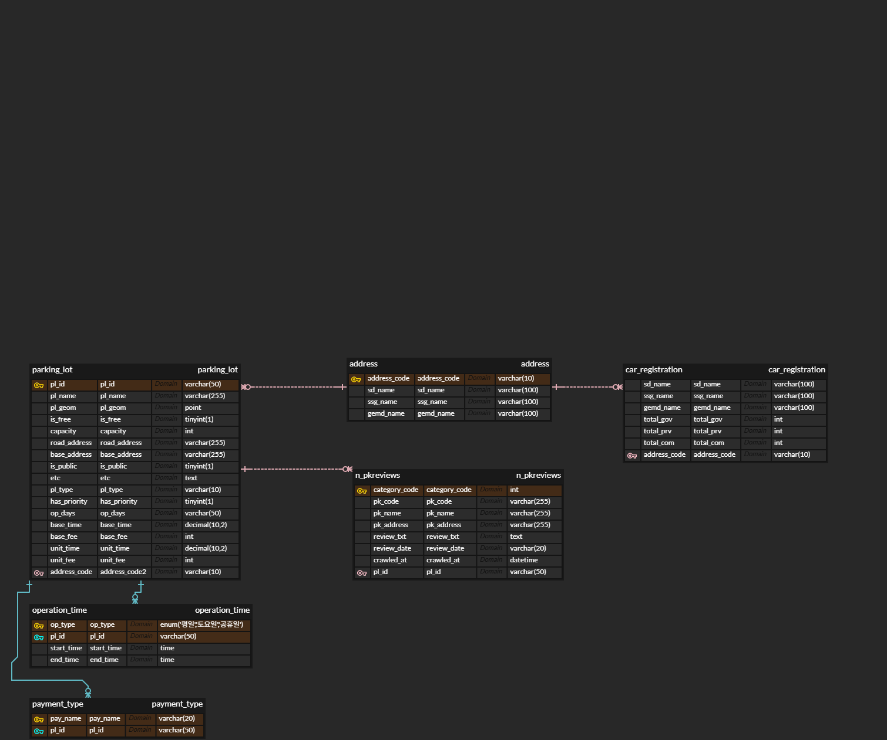

# 🅿️ Car Park Search
### 주차장 검색 및 지역별 주차 수급 분석 대시보드
> **SK Networks Family 28기 1차 프로젝트 (2조)** > 공공데이터 기반 주차장 데이터 분석 및 의사결정 지원 웹 서비스

---

## 1. 📝 프로젝트 개요

**❓ 기획 배경** 기존 지도 서비스는 '현재 빈자리'는 보여주지만, 해당 지역의 **근본적인 주차 난이도**는 알 수 없습니다.

**💡 해결 방안** 단순 조회를 넘어, 데이터 기반의 혼잡도 분석을 통해 사용자의 이동 및 주차 의사결정을 돕는 대시보드를 제공합니다.
- 자동차 등록 대수 vs 주차 면수 비교
- 지역별 주차 수급 불균형 분석
- 정량 데이터와 정성 데이터(리뷰) 결합을 통한 혼잡도 도출

---

## 2. 🚀 핵심 기능

- **주차장 맞춤 검색**
  - 이름 기반 검색 및 실시간 운영 여부 필터링
  - 결제 수단 필터 (현금 / 카드)
  - 당일 운영 마감까지 남은 시간 자동 계산
- **지역별 주차 통계 파악**
  - 차량 등록 대수 대비 주차 면수 비교
  - 행정구역별 주차 부족도 분석 및 시각화
- **혼잡도 지수 분석**
  - 네이버/구글 리뷰 데이터 기반 핵심 키워드 추출
  - 지역별 주차 난이도 등급화 제공

---

## 3. 👥 팀 소개 및 역할

| 이름 | 역할 | GitHub |
|:---:|---|---|
| **박건우** | Team Leader / DB 설계 및 ERD 구축 / 구글 리뷰 크롤링 | 
| **김성재** | 데이터 수집 및 전처리 / 자동차 등록 데이터 가공 | - |
| **송윤경** | 데이터 가공 / UI·UX 설계 / 중랑구 주차 데이터 분석 | - |
| **이명빈** | 전국 주차장 데이터 처리 및 정제 | - |
| **전하영** | 네이버 리뷰 크롤링 / 협업 환경(노션) 구축 | - |

---

## 4. 🛠️ 기술 스택

| 분야 | 사용 기술 |
|---|---|
| **Language** | Python 3.12 |
| **Web Framework**| Streamlit |
| **Database** | MySQL 8.0 |
| **Data Analysis**| Pandas |
| **Visualization**| Matplotlib, Folium |
| **Crawling** | BeautifulSoup, Selenium, Requests |

---

## 5. 🗄️ 데이터베이스 설계 (ERD)

